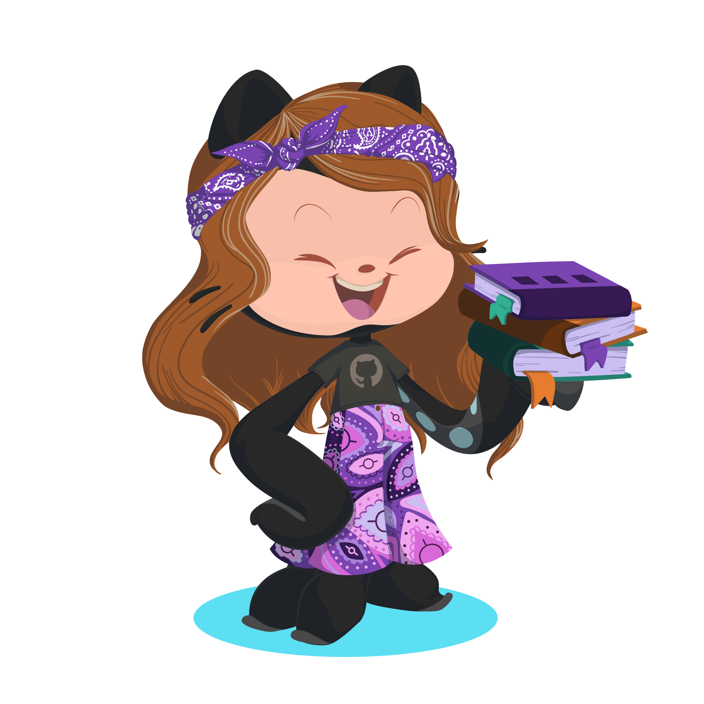

<!-- NICKNAME PANEL START-->
  
  
<!-- newline -->  
<!-- newline -->  
<!-- newline -->  
<!-- newline -->  
<!-- newline -->  
<!-- newline -->  
 

<!-- NICKNAME PANEL END-->

### Hi there 👋
Im Angelina.  
:books: Currently 3rd year Bachelors degree in Software Engineering.  
:scroll: Professional diploma in System programming  
:large_blue_diamond: MLH Fellow '20-'21  
:triangular_flag_on_post: CTF participant  
Feel free to reach out to me for anything!~

  

